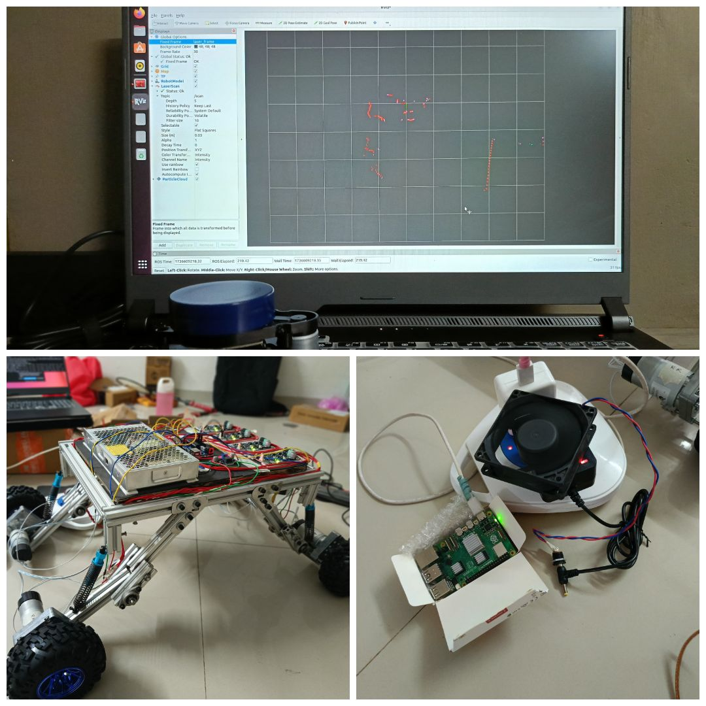

# Patrol Bot - ROS2 Autonomous Mobile Robot

## Overview
Patrol Bot is a ROS2-based autonomous mobile robot designed for surveillance and patrolling tasks using LiDAR-based navigation and SLAM.

## Features
- Autonomous navigation using Nav2
- Waypoint following
- Obstacle avoidance
- SLAM mapping

## patrl_bot images

## Technologies Used
- ROS2
- Nav2
- Gazebo
- RViz
- Python
- LiDAR

## System Architecture
LiDAR → SLAM → Nav2 Planner → Controller → Motor Driver

## Demo videos
## implemented SLAM functionality using the slam_toolbox
[slam](videos/implemented_SLAM)

## combination of the SmacPlannerLattice for path planning, paired with the MPPI Controller and SimpleSmoother, delivers the best performance for our robot. To validate this, we conducted a side-by-side comparison with the default Nav2 stack plugins, such as NavFn and DWB Controller. The results clearly demonstrate the superiority of our chosen approach in meeting our specific requirements.
[path_planning](videos/path_planning)
